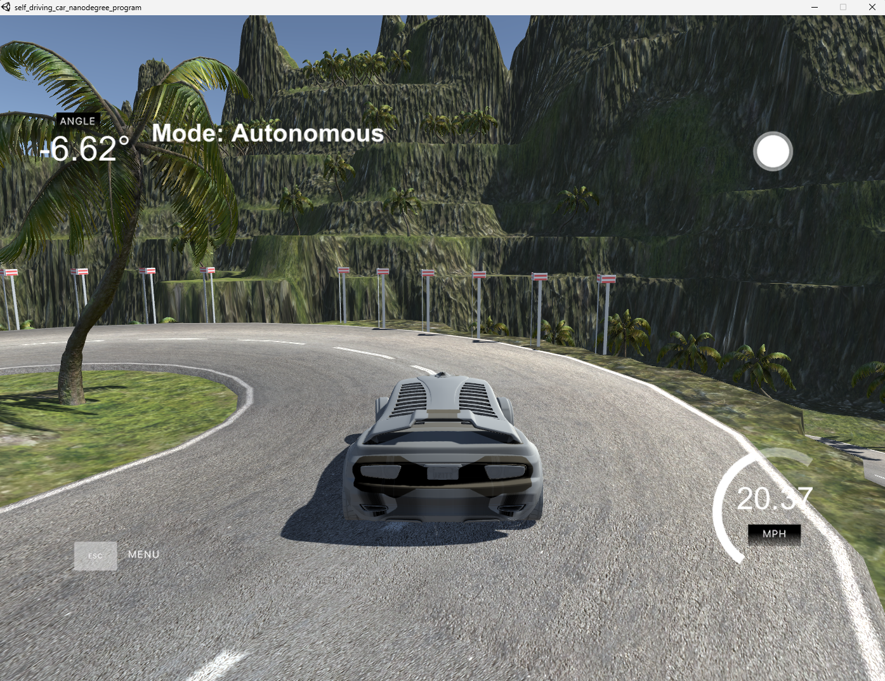

# Behavioral Cloning Self Driving Car

## Demo

[Watch the driving demo (self_drivinng_car.mov)](self_drivinng_car.mov)

## Summary

Behavioral cloning is a machine learning technique used to teach self-driving cars to mimic the actions of a human driver. It involves collecting data from a human driver navigating a car through v[...]

## Background
The development of self-driving cars has been motivated by a number of factors, including the potential to reduce traffic accidents, improve transportation efficiency, and provide accessibility to [...]

Behavioral cloning has emerged as a promising approach for developing self-driving cars because it allows the car to learn from the experience of a human driver. By collecting data from a human dr[...]

One advantage of using behavioral cloning is that it can allow a self-driving car to learn from the experience of a skilled human driver, potentially leading to better performance than if the car [...]
It can potentially be used to solve the problem of developing a self-driving car that can navigate roads and traffic conditions in a way that is similar to how a human driver would.

Using behavioral cloning to develop a self-driving car can help to reduce the need for human drivers, potentially addressing issues such as traffic congestion, accidents, and accessibility. Howeve[...]

## How it is used ?

To use behavioral cloning to develop a self-driving car, the following steps can be followed:

Collect data: Data is collected from a human driver navigating a car through various roads and traffic conditions. This data can include the input (e.g., camera images), as well as the correspondi[...]

Preprocess data: The collected data may need to be preprocessed in order to remove any noise or inconsistencies. This can involve techniques such as cropping, resizing, or normalizing the input da[...]

Train a model: A deep neural network is trained on the collected and preprocessed data to predict the appropriate steering and acceleration commands given a particular input.

Evaluate the model: The trained model is evaluated on a hold-out dataset to determine its performance. If the performance is not satisfactory, the model may need to be refined by collecting additi[...]

Deploy the model: Once the model has been trained and evaluated, it can be deployed in a self-driving car to control its steering and acceleration.

It is important to note that self-driving cars developed using behavioral cloning may still need to be equipped with additional sensors and algorithms to handle the full range of driving situation[...]

## Data sources and AI methods

To use behavioral cloning to develop a self-driving car, data is collected from a human driver navigating a car through various roads in the unity simulator. This data includes input from three ca[...]

The collected data is typically preprocessed in order to remove any noise or inconsistencies. This can involve techniques such as cropping, resizing, or normalizing the input data.

To train a model using behavioral cloning, a deep neural network is typically used. The neural network is trained on the collected and preprocessed data to predict the appropriate steering and acc[...]

Other AI methods that may be used in conjunction with behavioral cloning include unsupervised learning, reinforcement learning, and transfer learning. These methods can be used to improve the perf[...]

## Challenges

There are several challenges associated with using behavioral cloning to develop self-driving cars, including:

Data quality: It is important to collect high-quality data in order to train a model that performs well. This can be challenging, as the data must accurately represent the various roads and traffi[...]

Generalization: The model trained using behavioral cloning must be able to generalize to new situations that it has not seen before. This can be challenging, as the model is only exposed to a limi[...]

Handling edge cases: Behavioral cloning does not explicitly take into account the rules of the road or the intentions of other drivers. As a result, the self-driving car may need to be equipped wi[...]

Ethical considerations: Self-driving cars have the potential to displace jobs in the transportation sector and raise ethical questions about the allocation of responsibility in the event of an acc[...]

Legal and regulatory issues: There are a number of legal and regulatory issues that need to be addressed in order to deploy self-driving cars on public roads. These issues can vary by country and [...]

## What next ?

It is difficult to predict exactly what the future will hold for self-driving cars and behavioral cloning. However, it is likely that both will continue to evolve and be refined over time.

One potential development is the wider adoption of self-driving cars, which could lead to significant changes in the transportation industry. This could have a range of impacts, including on emplo[...]

Another potential development is the further integration of self-driving cars with other technologies, such as the Internet of Things (IoT) and 5G networks. This could enable self-driving cars to [...]

It is also possible that new approaches to developing self-driving cars will emerge, such as hybrid systems that combine behavioral cloning with other machine learning techniques.
